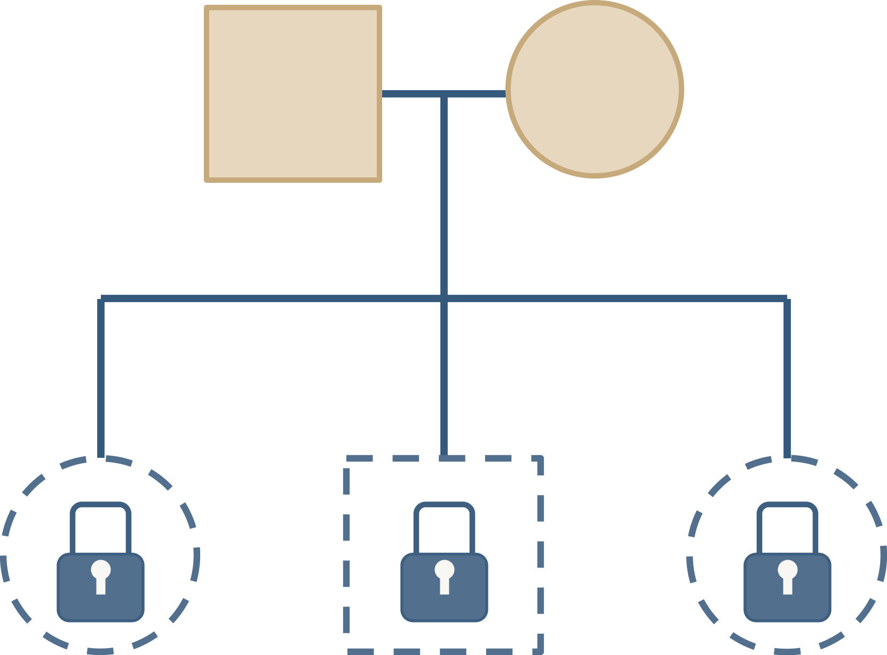

<!-- README.md is generated from README.Rmd. Please edit that file -->

# Famnesia 

**Try Famnesia online here:** <https://magnusdv.shinyapps.io/famnesia/>

Famnesia is a Shiny app for anonymising files from
[Familias](https://familias.no/), a program for kinship calculations in
forensic genetics. Several other programs also take Familias `.fam`
files as input, including [KLINK](https://github.com/magnusdv/KLINK) and
other tools in the [pedsuite](https://magnusdv.github.io/pedsuite/).

The aim of Famnesia is to enable safer sharing of `.fam` files, for
instance for:

- collaborative work and research
- troubleshooting and software support
- teaching and demonstrations
- reproducible examples and testing

## How does Famnesia mask the data?

Available data maskings include:

- names of families, individuals, markers and alleles
- changing sex of individuals
- lumping unobserved alleles
- perturbing allele frequencies
- simplifying or disabling mutation models

The `Analyse file` feature offers three masking strategies adapted to
the input data:

- `Max`: Maximal masking
- `Suggested`: Balance strong masking with near-preserved LR values
- `Keep LR`: The strongest masking that preserves all LRs exactly

The result can be downloaded as a new `.fam` file.

## Running locally

To run **famnesia** locally (and offline, if needed), first install the
R package:

``` r
remotes::install_github("magnusdv/famnesia")
```

When the package is installed, the app can be started with a single R
command:

``` r
famnesia::launchApp()
```

## Limitations

- Files from the Familias DVI module are not yet supported.
- Displayed LRs within Famnesia currently ignore `theta` corrections,
  and only use the first two pedigrees in file.  
  (But `theta`’s and all pedigrees *are* included in the masked output
  file.)
- While Famnesia substantially reduces the recognisable information, it
  does not guarantee that genetic data cannot be reidentified.
